# Agenda Espiritual ✦

> A full-featured management app built for a spiritual services professional — handling clients, appointments, spiritual works, finances, and debt tracking in a single-file React application.

Built as a real-world tool currently in active use, managing 65+ clients and 84+ appointments.

---

## Screenshots

### Dashboard
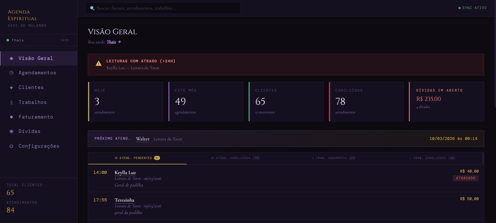
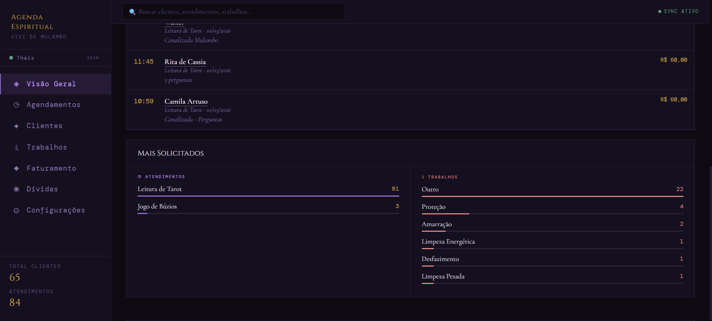

### Appointments
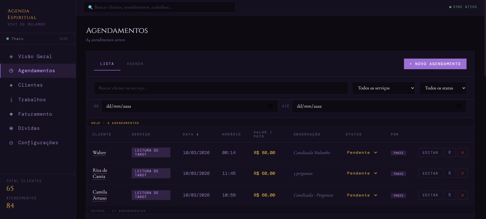
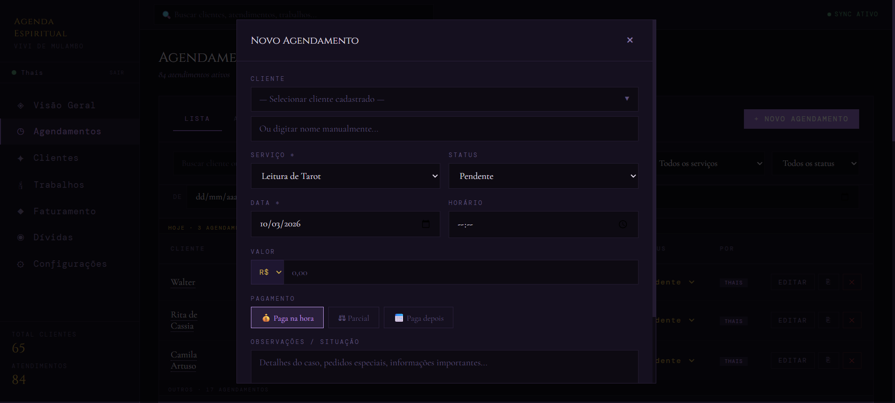

### Clients
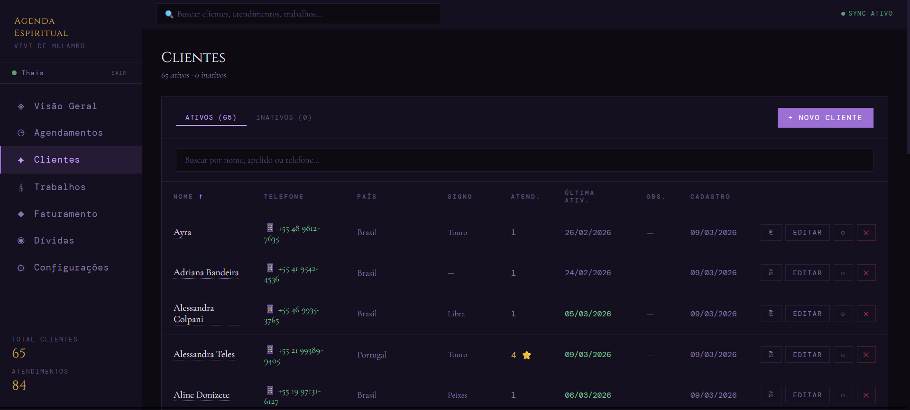
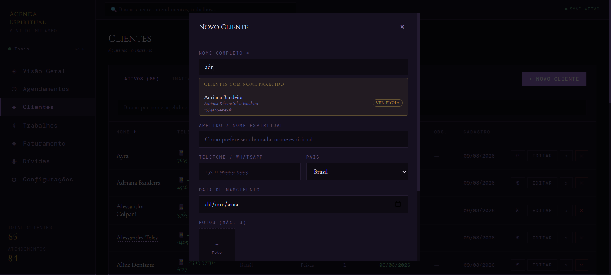

### Spiritual Works
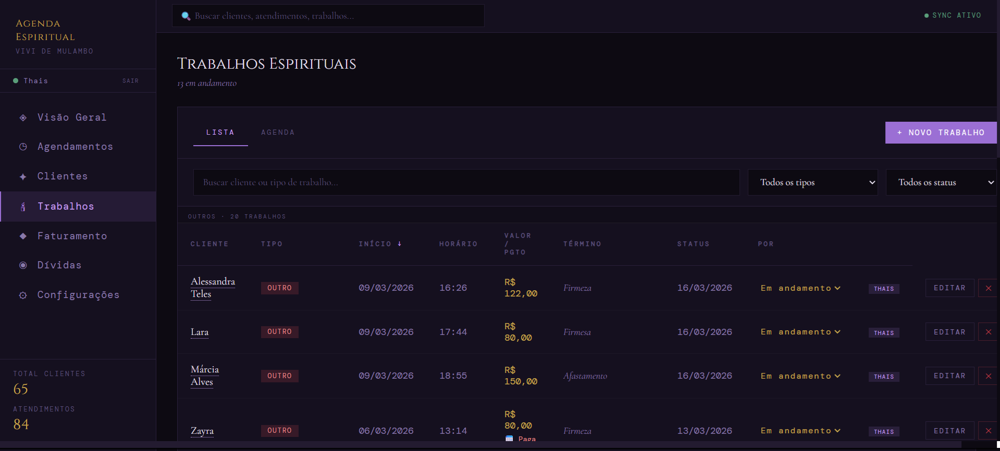

### Finance
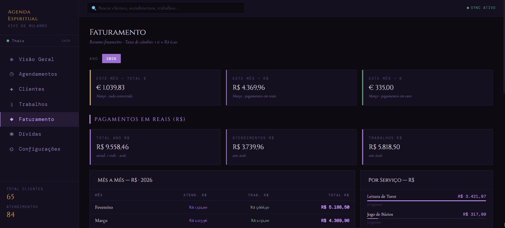
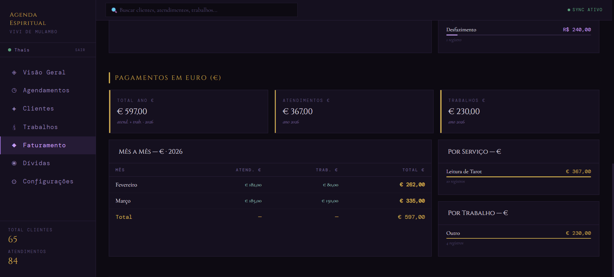

### Debts
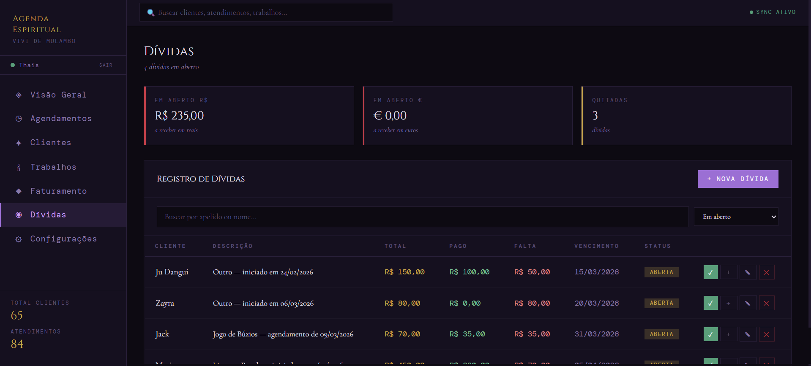

### Settings
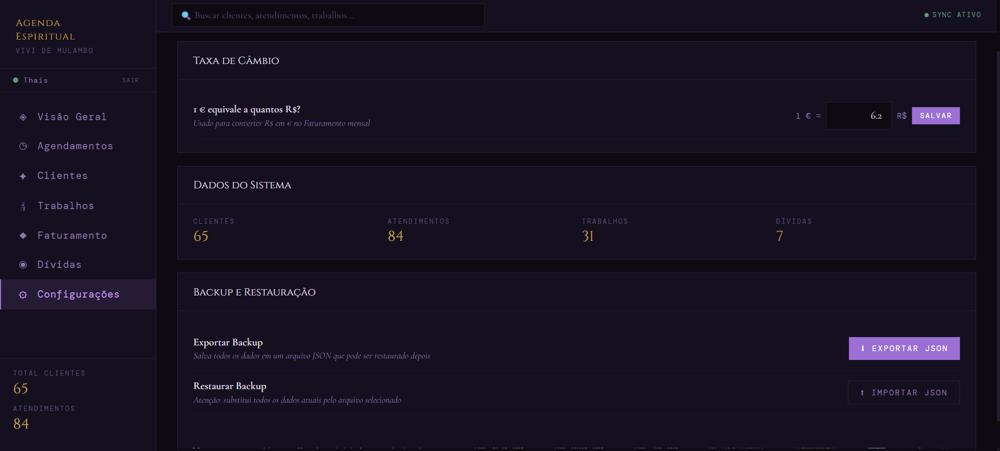

### Client Profile
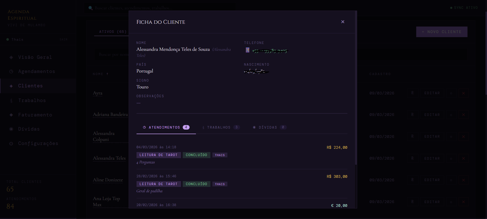

---

## About the Project

This app was designed and developed from scratch as an internal management tool for a holistic therapist who serves clients across Brazil and Europe. Before this app, everything was tracked manually. The goal was to centralize client data, automate debt creation from appointments, and provide a clear financial overview in two currencies.

The app is currently in production use, with real data from an active practice.

---

## Features

**Dashboard**
- Personalized greeting based on time of day
- Stats cards: today's appointments, monthly total, active clients, completed sessions, open debts
- Alert banner for overdue readings (>24h)
- Next appointment preview with client name and service
- Tabbed list: pending appointments, completed, works in progress, completed works
- "Most requested" ranking for services and spiritual work types

**Appointments**
- Grouped by date: Today / Tomorrow / This Week / Others
- Filter by service type, status, and date range
- Payment flow: paid on the spot / partial / deferred
- Auto-creates a linked debt when payment is pending or partial
- Inline status update without opening the edit modal
- Confirmation toast with session summary, queued if multiple saves happen quickly

**Clients**
- Sortable table with zodiac sign (auto-calculated from birthdate), last activity date, and debt badge
- Real-time duplicate detection while typing the name — shows matching clients with "view profile" link before saving
- Client profile modal with full history: appointments, spiritual works, and open debts in tabs
- Photo upload (up to 3 photos per client)
- Active / inactive toggle

**Spiritual Works**
- Filter by work type (8 types) and status independently
- Start date, end date, description, and result fields
- Same payment flow as appointments with linked debt creation

**Finance**
- Monthly breakdown separated by currency: BRL and EUR
- Revenue split by appointments vs spiritual works
- Breakdown by service type and work type
- Configurable exchange rate (BRL/EUR) used across all conversions
- Dynamic year selector based on actual data — no hardcoded years

**Debts**
- Auto-created when saving appointments or works with pending payment
- Linked directly to the source record via `sourceId` — no ambiguous matching
- Partial payment registration inline, without opening a separate modal
- Automatically marks as settled when balance reaches zero
- Filter: open / settled / all

**Settings**
- Exchange rate configuration
- System stats overview
- Full data export and import via JSON backup

**Global UX**
- Global search bar across clients, appointments, and works — clears automatically on navigation
- Custom confirmation modal (no browser `window.confirm`)
- Escape key closes all modals
- Pagination resets when sort column changes
- Dark theme with CSS custom properties throughout

---

## Tech Stack

| Technology | Usage |
|---|---|
| React 18 | UI and state management (via CDN, no build step) |
| Babel Standalone | JSX transpiled in the browser |
| localStorage | Client-side data persistence |
| CSS3 + Custom Properties | Dark mystical theme, responsive layout |
| Google Fonts | Cinzel + Cormorant Garamond + DM Mono |

No frameworks, no dependencies, no build tools — the entire app ships as a single `index.html` file.

---

## Architecture Highlights

- **Single-file React app** — all components, hooks, styles, and logic in one HTML file, runnable without any setup
- **Custom hooks** — `usePagination` and `useSortable` for reusable table behavior across all list views
- **Linked debt system** — debts store a `sourceId` pointing to the originating appointment or work, ensuring accurate financial calculations even when a client has multiple debts
- **Real-time duplicate detection** — client name field queries existing records on every keystroke using substring matching, surfacing potential duplicates before the record is saved
- **Notification queue** — save confirmations use a queue rather than a single state, so rapid consecutive saves don't lose feedback

---

## Project Structure

```
agenda-espiritual/
├── index.html   ← complete app (HTML + CSS + React in a single file)
└── README.md
```

---

## Context

- **User:** Spiritual practitioner managing an active client base
- **Data:** 65 clients · 84 appointments · 31 spiritual works · 7 debts tracked
- **Revenue tracked:** R$ 9,558 + € 597 (2026 YTD at time of screenshot)
- **Deployment:** Single HTML file, runs directly in the browser
